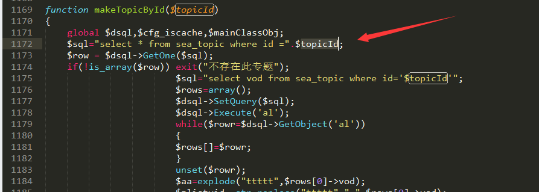
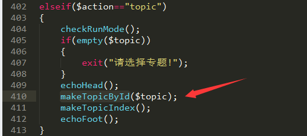
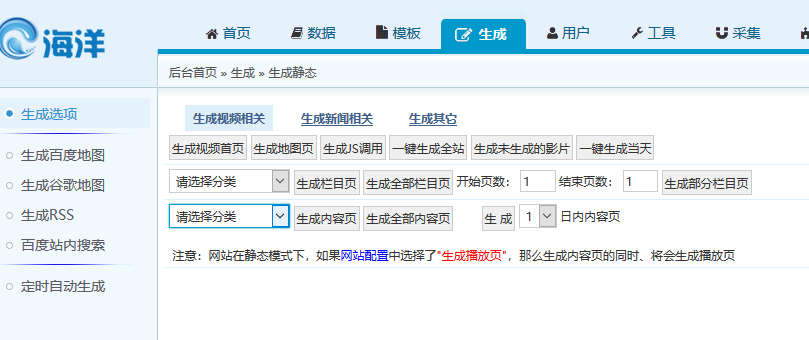
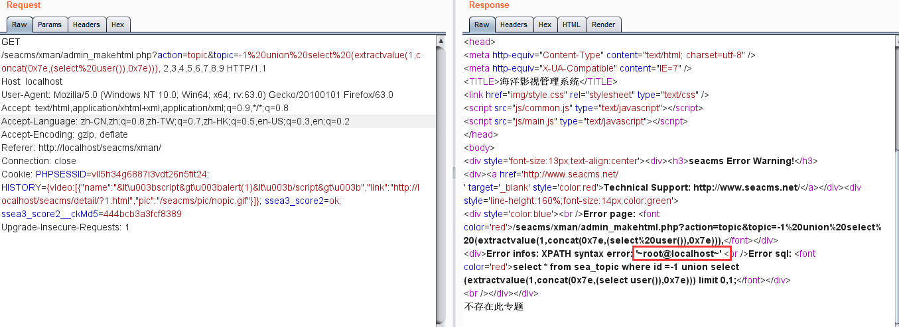

In the file seacms/include/mkhtml.func.php, line 1172

The $topicId parameter has no single quote protection, making GPC's global single quote protection invalid. In seacms/admin/admin_makehtml.php, line 410, the makeTopicById function is called.

This request is called when the web page is generated in the background.

Then the topic parameter can be SQL injected.
?action=topic&topic=-1%20union%20select%20(extractvalue(1,concat(0x7e,(select%20user()),0x7e))),2,3,4,5,6,7,8,

