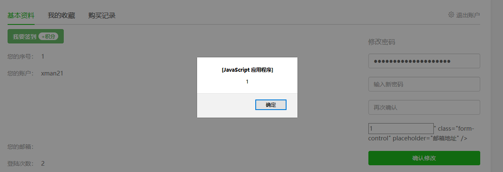

User ***REMOVED*** will be submitted when the password is changed.

The code to change the password is 43 lines in seacms/member.php. There is no security or even format detection for $email before inserting, directly insert into the database, resulting in storage XSS

Code is executed when a user visits or an administrator visits a website.

